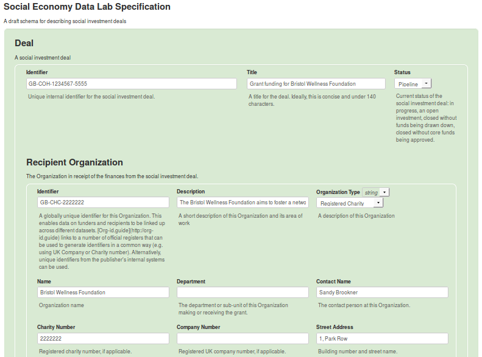

# Developing Visual Representations of JSONSchema Specifications

This framework in this repository is aimed at standards adoption practitioners aiming to present the components of a JSONSchema standard or specification to non-familiar audiences. **An existing JSONSchema file is a prerequisite**.

## Aim

> Within this how-to guide, the focus is on the [Social Economy Data Lab](http://socialeconomydatalab.org/), its [Specification](http://spec.socialeconomydatalab.org/en/latest/), the [Schema](https://github.com/SocialEconomyDataLab/spec/blob/master/schema/schema.json).

When trying to communicate what a new standard could communicate and what the associated data could look like, and when trying to gather feedback from prospective users of it, a JSONSchema specification has some fundamental advantages, and some fundamental drawbacks.

Take the following starting section of the draft schema for Social Economy Data Lab Specification:

```js
{
    "$schema": "http://json-schema.org/draft-04/schema#",
    "id": "https://github.com/SocialEconomyDataLab/spec/blob/master/schema/schema.json",
    "title": "Social Economy Data Lab Specification",
    "description": "A draft schema for describing social investment deals",
    "type": "object",
    "properties": {
        "Deal": {
            "title": "Deal",
            "description": "A social investment deal",
            "type": "object",
            "required": ["identifier","title","recipientOrganization","arrangingOrganization","investments","dealDate"],
            "properties": {
                "identifier": {
                    "title": "Identifier",
                    "description": "Unique internal identifier for the social investment deal.",
                    "type": "string"
                },
                "title": {
                    "title": "Title",
                    "description": "A title for the deal. Ideally, this is concise and under 140 characters.",
                    "type": "string"
                }
              // the rest of the schema has been truncated here...  
            }
        }
    }
}
```

Although this is very precise, it's not engaging, and it's hard to envisage what the data it standardises would look like.

The aim of this resource is to guide a semi-technical open data practitioner to creating visual representations of possible data which look like this:



These take the form of web-pages. Their components can be extracted via a screenshot, and their structure can be modified with different versions of a JSON data file which adheres to the Schema.

## Walk Through

Before beginning, ensure the following:

* You have a full, valid JSONSchema which describes your data standard. It doesn't have to be final, but it must be functional (in that all of the references resolve, etc.). See [this schema](https://github.com/SocialEconomyDataLab/spec/blob/master/schema/schema.json) for an example.
* You have access too this online tool: https://json-editor.github.io/json-editor. It is the backbone of this process, so play around with your schema and get familiar with the user interface.
* OPTIONAL: get to grips with Chrome's 'Overrides' feature - it's really useful for persisting the tweaks you make to CSS.

### Getting your Schema, and Empty Data File

1. create a new directory at `standards/<standard-name>/` and save your JSONSchema file there as `original-schema.json`
2. go to https://json-editor.github.io/json-editor
3. scroll down, and paste your whole JSONSchema file into the box labelled 'Schema', and click 'Update Schema'
4. scroll through the newly generated form and click 'add item' wherever you would like at least one instance of an array to be included in your data
5. fill out all of the example data you'd like in the form and then copy the resulting JSON data from the 'JSON Output' box and save it to `standards/<standard-name>/full-json-data.json`
 > note that after added the empty objects, you can copy the file without any data input and fill it later in a text editor if that's your style

### Using json-editor

The following configuration options allow for a fiarly clean layout with the ability to collapse features as needed


These settings can be changed to add in more example data.

### Getting Images

Once you've created all of the example data required, screenshot the components you need.

### Tweaking Styling

#### Chrome Overrides

Using Google Chrome developer tools, it's now possible to setup local overrides for the styling of websites. Documentation for getting started with this can be found here: https://www.ghacks.net/2018/02/27/make-permanent-changes-to-web-pages-with-chromes-overrides-dev-tool/

In the `styling/` directory there is a pre-made directory which contains a modified version of the json-editor css. it's folder structure is important to preserve:

```
Styling
  └── netdna.bootstrapcdn.com
      └── twitter-bootstrap
          └── 2.3.2
              └── css
                  └── bootstrap-combined.min.css
```

The default tweaks included expand the canvas and give a more palatable green background.

#### Simple CSS Replace

If you don't want to use chrome, or don't have time to setup the persistent changes, you can always just paste the CSS file included above into your developer tools in any browser to temporarily tweak the styling.

#### Javascript Button Removal

The json-editor allows a user to toggle the various buttons, but doing so reverses their effect. As a workaround, define the following javascript function in your browswer console, and pass it 'true' or 'false' to show or hide all of the buttons:

```js
function buttons_showing(true_or_false){ if(true_or_false) {for (let el of document.querySelectorAll('.btn-group')) el.style.visibility = 'visible';} else {for (let el of document.querySelectorAll('.btn-group')) el.style.visibility = 'hidden';}}
```

You can then toggle the buttons by entering `buttons_showing(true)` or `buttons_showing(false)` to show or hide the buttons respectively.
