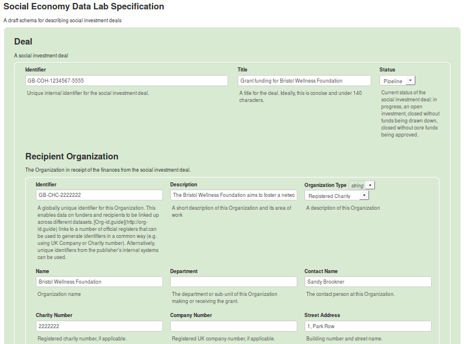

# Developing Visual Representations of JSONSchema Specifications

This framework in this repository is aimed at standards adoption practitioners aiming to present the components of a JSONSchema standard or specification to non-familiar audiences. **An existing JSONSchema file is a prerequisite**.

## Aim

> Within this how-to guide, the focus is on the [Social Economy Data Lab](http://socialeconomydatalab.org/), its [Specification](http://spec.socialeconomydatalab.org/en/latest/), the [Schema](https://github.com/SocialEconomyDataLab/spec/blob/master/schema/schema.json).

When trying to communicate what a new standard could communicate and what the associated data could look like, and when trying to gather feedback from prospective users of it, a JSONSchema specification has some fundamental advantages, and some fundamental drawbacks.

Take the following starting section of the draft schema for Social Economy Data Lab Specification:

```js
{
    "$schema": "http://json-schema.org/draft-04/schema#",
    "id": "https://github.com/SocialEconomyDataLab/spec/blob/master/schema/schema.json",
    "title": "Social Economy Data Lab Specification",
    "description": "A draft schema for describing social investment deals",
    "type": "object",
    "properties": {
        "Deal": {
            "title": "Deal",
            "description": "A social investment deal",
            "type": "object",
            "required": ["identifier","title","recipientOrganization","arrangingOrganization","investments","dealDate"],
            "properties": {
                "identifier": {
                    "title": "Identifier",
                    "description": "Unique internal identifier for the social investment deal.",
                    "type": "string"
                },
                "title": {
                    "title": "Title",
                    "description": "A title for the deal. Ideally, this is concise and under 140 characters.",
                    "type": "string"
                }
              // the rest of the schema has been truncated here...  
            }
        }
    }
}
```

Although this is very precise, it's not engaging, and it's hard to envisage what the data it standardises would look like.

The aim of this resource is to guide a semi-technical open data practitioner to creating visual representations of possible data which look like this:



These take the form of webpages. Their components can be extracted via a screenshot, and their structure can be modified with different versions of a JSON data file which adheres to the Schema.

## Walk Through

Before beginning, ensure the following:

1. You have a full, valid JSONSchema which describes your data standard. It doesn't have to be final, but it must be functional (in that all of the references resolve, etc.). See [this schema](https://github.com/SocialEconomyDataLab/spec/blob/master/schema/schema.json) for an example.
2. You have access too this online tool: https://json-editor.github.io/json-editor. It is the backbone of this process, so play around with your schema and get familiar with the user interface.
3. OPTIONAL: get to grips with Chrome's 'Overrides' feature - it's really useful for persisting the tweaks you make to CSS.
